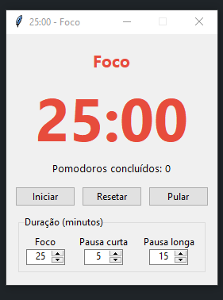

# 🍅 Pomodoro

Timer Pomodoro simples para desktop, feito em Python com `tkinter`. Mostra a contagem em minutos e segundos e permite ajustar a duração de cada etapa.



## Funcionalidades

- Contagem regressiva no formato `MM:SS`
- Três modos: **Foco**, **Pausa curta** e **Pausa longa** (a cada 4 pomodoros)
- Durações configuráveis (em minutos) direto na tela
- Botões de **Iniciar/Pausar**, **Resetar** e **Pular**
- Alerta sonoro e janela em primeiro plano ao fim de cada etapa
- Tempo restante exibido também no título da janela
- Contador de pomodoros concluídos

## Padrões

| Etapa        | Duração |
|--------------|---------|
| Foco         | 25 min  |
| Pausa curta  | 5 min   |
| Pausa longa  | 15 min  |

## Requisitos

- Python 3.8 ou superior
- `tkinter` (já incluso na instalação padrão do Python no Windows e no macOS; no Linux pode ser necessário instalar `python3-tk`)

Não há dependências externas para rodar o app.

## Como executar

```bash
git clone https://github.com/SEU_USUARIO/pomodoro.git
cd pomodoro
python pomodoro.py
```

## Como gerar o executável (.exe)

O executável precisa ser gerado no mesmo sistema operacional em que será usado. Para Windows:

```bash
pip install pyinstaller
pyinstaller --onefile --windowed pomodoro.py
```

O arquivo final fica em `dist/pomodoro.exe`. Ele é portátil: pode ser movido para qualquer pasta e roda sem precisar do Python instalado.

> Alguns antivírus podem acusar falso positivo em executáveis gerados com PyInstaller. Se isso acontecer, libere o arquivo manualmente.

## Como usar

1. Ajuste as durações nos campos de **Duração (minutos)**.
2. Clique em **Iniciar** para começar o foco.
3. Ao terminar, o app avisa e passa para a próxima etapa. Clique em **Iniciar** para continuar.
4. Use **Pular** para ir direto à próxima etapa ou **Resetar** para reiniciar a etapa atual.

As durações só são aplicadas na hora quando o timer está parado.

## Estrutura do projeto

```
pomodoro/
├── pomodoro.py
├── screenshot.png
└── README.md
```

## Próximos passos

- [ ] Iniciar a próxima etapa automaticamente (opcional)
- [ ] Salvar configurações em arquivo JSON
- [ ] Notificações do sistema
- [ ] Histórico de sessões
- [ ] Ícone na bandeja do sistema
- [ ] Instalador para Windows

## Licença

Distribuído sob a licença MIT. Veja o arquivo `LICENSE` para mais detalhes.